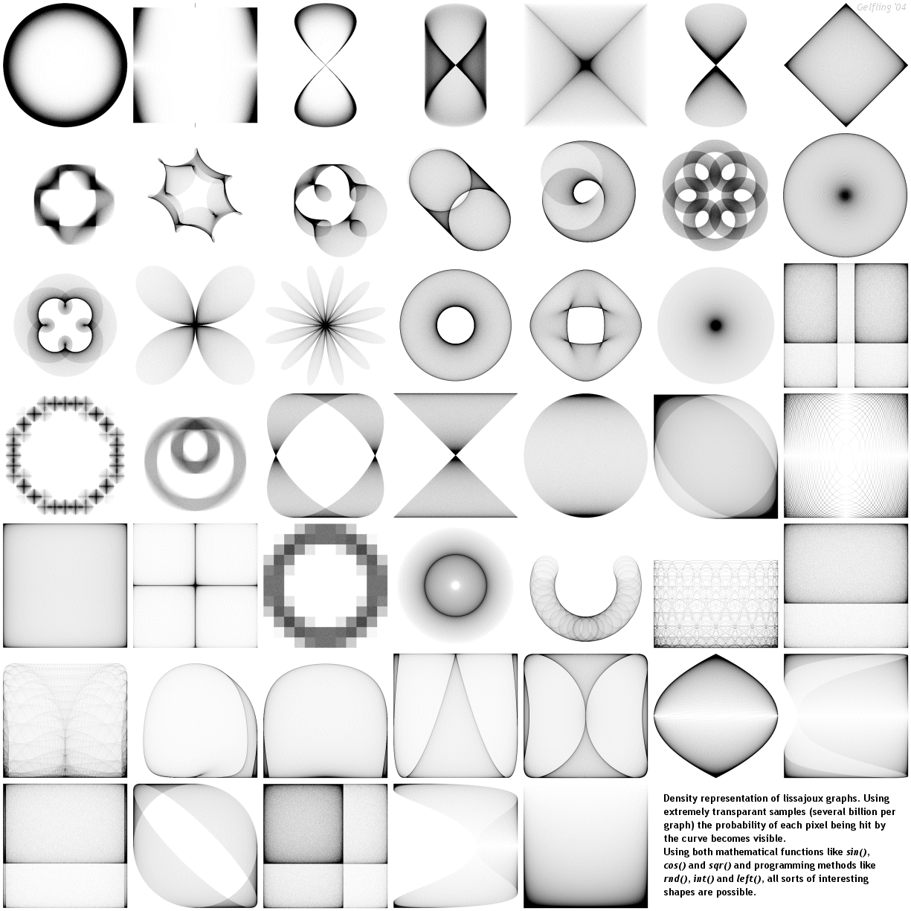



## Lissajoux grapher

### Description

This application graphs the lissajoux density. It comes with the function interpreter and several rendering modes. See the screenshot for some results.
 
### More Info
 
2 functions with domain (-1..1) for t = 0 to infinity.

the applications renders a graphical representation of lissajoux density.

No known side-effects.

             |
---                |---
**Submitted On**   |2004-07-22 12:15:28
**By**             |[David Rutten](https://github.com/Planet-Source-Code/PSCIndex/blob/master/ByAuthor/david-rutten.md)
**Level**          |Intermediate
**User Rating**    |5.0 (25 globes from 5 users)
**Compatibility**  |VB 6\.0
**Category**       |[Complete Applications](https://github.com/Planet-Source-Code/PSCIndex/blob/master/ByCategory/complete-applications__1-27.md)
**World**          |[Visual Basic](https://github.com/Planet-Source-Code/PSCIndex/blob/master/ByWorld/visual-basic.md)
**Archive File**   |[Lissajoux\_1775007282004\.zip](https://github.com/Planet-Source-Code/david-rutten-lissajoux-grapher__1-55196/archive/master.zip)

